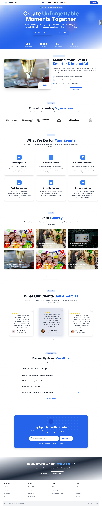

# Eventure - Modern Event Management System

<div align="center">
  
  <p><i>Your Vision, Our Expertise - Unforgettable Events</i></p>
</div>

## Overview

Eventure is a comprehensive event management platform built with Django, designed to streamline the entire event planning process. From corporate retreats to weddings and conferences, Eventure helps organizers create, manage, and promote exceptional events while providing attendees with a seamless experience.

## Key Features

- **User-Friendly Dashboard**: Intuitive interface for event creation and management
- **Responsive Design**: Beautiful UI that works flawlessly across all devices
- **Role-Based Permissions**: Different access levels for organizers, Admin, and Participant
- **Customizable Event Pages**: Personalize event details, images, and descriptions
- **Attendee Management**: Track registrations, send updates, and manage communications
- **Interactive Testimonials**: Swiper JS carousel showcasing client feedback

## Tech Stack

- **Backend**: Django (Python web framework),cloudinary
- **Frontend**: HTML, CSS, JavaScript
- **CSS Framework**: Tailwind CSS
- **Database**: PostgreSQL
- **Authentication**: Django Authentication System with extended user profiles
- **Responsive Design**: Mobile-first approach
- **Form Handling**: Custom Django forms with advanced styling
- **Interactive Elements**: Swiper JS,

## Installation

### Prerequisites

- Python 3.8+
- pip (Python package manager)
- Node.js and npm (for Tailwind CSS)

### Setup

1. Clone the repository

   ```bash
   git clone https://github.com/yourusername/eventure.git
   cd eventure
   ```

2. Create and activate a virtual environment

   ```bash
   python -m venv event-env
   source event-env/Scripts/activate  # On Windows: event-env\Scripts\activate
   ```

3. Install Python dependencies

   ```bash
   pip install -r requirements.txt
   ```

4. Install frontend dependencies

   ```bash
   npm install
   ```

5. Run database migrations

   ```bash
   python manage.py migrate
   ```

6. Create a superuser

   ```bash
   python manage.py createsuperuser
   ```

7. Run the development server

   ```bash
   python manage.py runserver
   ```

8. Open your browser and navigate to `http://localhost:8000`

## Features in Detail

### User Management

- **Custom User Model**: Extended Django's user model with profile images and additional fields
- **Authentication**: Login, registration, password reset
- **Role Management**: Admin, Event Organizer, and Participant roles with granular permissions

### Event Management

- **Event Creation**: Title, description, date, time, location, categories
- **Media Upload**: Support for event images and promotional materials
- **Event Categories**: Organize events by type
- **Event Search**: Find events by name, date, category, or location

### Frontend Features

- **Responsive Design**: Mobile-first approach with Tailwind CSS
- **Interactive UI**: Modern design with smooth transitions and animations
- **Testimonials**: Swiper JS carousel for client feedback display
- **Custom Styling**: Consistent application of brand colors and design elements throughout the application

## Screenshots

<div align="center">
  
  <p><i>Homepage with modern red theme design</i></p>
  
  
  <p><i>Events listing with filtering options</i></p>
  
  
  <p><i>Interactive testimonials carousel</i></p>
</div>

## User Roles and Permissions

- **Administrator**: Full access to all features and administrative functions
- **Event Organizer**: Create and manage events, view participant information
- **Participant**: Register for events, update personal information
- **Guest**: Browse events and view public information

## Future Enhancements

- **Calendar Integration**: Sync events with Google Calendar and other platforms
- **Mobile App**: Native mobile applications for iOS and Android
- **Advanced Analytics**: Enhanced reporting capabilities with data visualization
- **Multi-language Support**: Internationalization for global accessibility
- **API Development**: RESTful API for third-party integrations

## Author

<!-- Add your information here -->

- **Name**: Mohammad Marouful Islam Zishan
- **LinkedIn**: [linkedin.com/in/mohammad-marouful-islam-zishan](https://linkedin.com/in/mohammad-marouful-islam-zishan)
- **GitHub**: [github.com/zishan344](https://github.com/zishan344)

## License

This project is licensed under the MIT License - see the LICENSE file for details.
